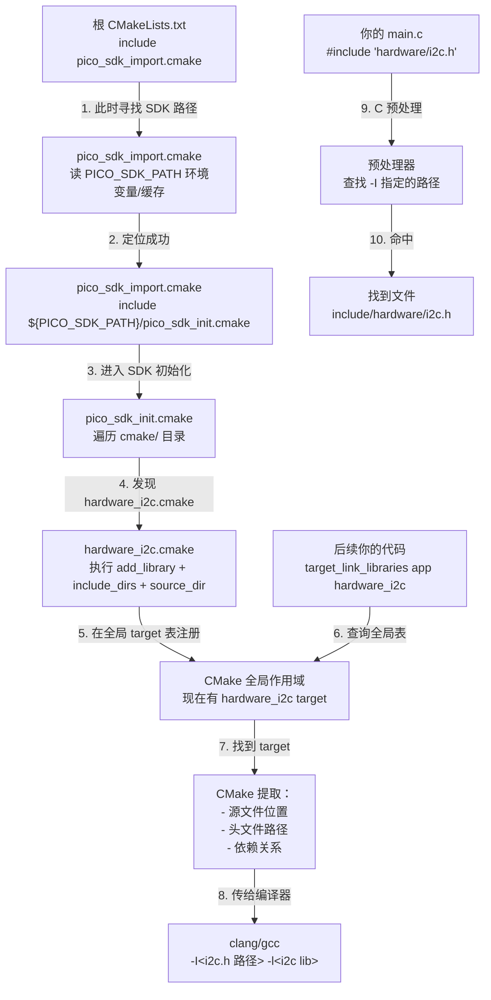

# CMakeLists 编写与模块化构建指南

> 工程根目录：`D:\Cursor\New_Tests`
> 目标芯片：RP2350（Pico 2）
> SDK：本地路径 `pico-sdk-master`（version 2.2.0）
> 构建系统：CMake + Ninja，由 VS Code Raspberry Pi Pico 扩展驱动

---

## 1. 核心概念：CMake Target 导入机制（为什么能用 hardware_i2c）

这是理解整个 Pico SDK 构建的关键。

### 1.1 不是"#include 头文件"就能用库 —— 是"链接一个 CMake target"

用户容易混淆两个概念：

**❌ 错误认知：**
```
#include "hardware/i2c.h"        ← 这只是让 C 预处理器找到头文件
→ 系统就能用 i2c 库了
```

**✅ 正确流程：**
```
第1步（CMake 配置阶段）：
  └─ pico_sdk_init() 
     └─ 读取 pico-sdk-master/ 内部的 CMake 脚本
        └─ 定义一个虚拟的"target"叫 hardware_i2c
           ├─ 这个 target 包含：
           │   ├─ 源文件在哪（<SDK>/src/rp2_common/hardware_i2c/...）
           │   ├─ 头文件目录在哪（指向 hardware_i2c.h）
           │   └─ 依赖什么其他库（hardware_base, hardware_gpio, ...）
           └─ 在 CMake 全局作用域注册这个 target 的定义

第2步（编译阶段）：
  └─ 你写 target_link_libraries(new_tests_app PUBLIC hardware_i2c)
     └─ CMake 查全局 target 表，找到 hardware_i2c 的定义
        └─ 提取该 target 的：源文件 → 编译、头文件路径 → -I 选项、依赖 → 递归链接
        └─ 把这些信息传给编译器

第3步（代码编译）：
  └─ 编译 main.c
     └─ C 预处理器执行 #include "hardware/i2c.h"
        └─ 使用第2步 CMake 提供的 -I<path-to-header> 找到它
```

**一句话：** `target_link_libraries()` 是 CMake 层面的"声明依赖"，`#include` 是 C 层面的"查找头文件"，两者缺一不可，但发生在不同阶段。

### 1.2 pico-sdk-master 的三层结构

```
pico-sdk-master/
│
├─ pico_sdk_init.cmake           ← 核心：定义所有 target（hardware_i2c、pico_stdlib 等）
│  （被 pico_sdk_import.cmake 的 include() 语句触发）
│
├─ pico_sdk_import.cmake         ← 定位脚本：告诉 CMake "SDK 根在哪"
│  （你的工程根目录有一份副本，你 include() 的是那一份）
│
├─ CMakeLists.txt                ← 仅当 SDK 作为独立 CMake 项目时用
│  （你的工程不用它；它让 SDK 开发者能 cd pico-sdk-master && cmake . && make）
│
├─ src/rp2_common/
│  ├─ hardware_i2c/
│  │  ├─ i2c.c
│  │  └─ include/hardware/i2c.h
│  ├─ hardware_gpio/
│  │  ├─ gpio.c
│  │  └─ include/hardware/gpio.h
│  └─ ...
│
├─ external/
│  └─ pico_sdk_import.cmake       ← 模板原件（供用户复制）
│
└─ cmake/
   ├─ hardware_i2c.cmake          ← 定义 hardware_i2c target 的脚本
   ├─ hardware_gpio.cmake
   └─ ...（pico_sdk_init.cmake 会遍历这些文件）
```

### 1.3 执行流程图（从你的根 CMakeLists 到系统识别 hardware_i2c）



---

## 2. 目录结构与分层职责

```text
New_Tests/                         ← 工程根
├─ CMakeLists.txt                  ← 顶层：定义最终可执行文件 + 组装模块
├─ pico_sdk_import.cmake           ← 工程自己的 SDK 定位脚本（从 SDK/external/ 复制）
├─ main.c                          ← 应用入口
│
├─ build/                          ← CMake 构建产物（可删）
│  └─ new_tests_app.uf2
│
├─ docs/
│  └─ CMakeLists_guide.md          ← 本文件
│
├─ camera_bringup_min/             ← 驱动层模块 1
│  ├─ CMakeLists.txt               ← 模块构建脚本
│  ├─ ov5640.c / ov5640.h
│  └─ heartbeat.pio
│
├─ imu_driver/                     ← 驱动层模块 2（示例）
│  ├─ CMakeLists.txt               ← 模块构建脚本
│  ├─ mpu6050.c / mpu6050.h
│  └─ ...
│
└─ pico-sdk-master/                ← Pico SDK（第三方，不动）
   ├─ pico_sdk_init.cmake          ← 定义所有 hardware_* target
   ├─ pico_sdk_import.cmake        ← 定位脚本副本
   ├─ CMakeLists.txt               ← SDK 自己的构建（你不用）
   ├─ src/rp2_common/
   └─ cmake/
```

| 层级 | CMakeLists 职责 | 禁忌 |
|---|---|---|
| **顶层（New_Tests/）** | ① 找 SDK (`include(pico_sdk_import.cmake)`) ② 初始化 SDK (`pico_sdk_init()`) ③ 注册所有子模块 (`add_subdirectory`) ④ 定义最终可执行文件 (`add_executable`) ⑤ 链接库 | 不要在这里写 `add_library(驱动库 ...)` |
| **模块层（camera_bringup_min/ 等）** | ① 定义该模块是静态库还是对象库 (`add_library`) ② 暴露自己的头文件目录 (`target_include_directories PUBLIC`) ③ 声明自己的依赖 (`target_link_libraries PUBLIC`) | 不要 `include(pico_sdk_import.cmake)` / `project()` / `pico_sdk_init()` |
| **SDK（pico-sdk-master/）** | 不写 | 完全不动 |

---

## 3. 顶层 `CMakeLists.txt` 完整模板与逐行解读

```cmake
# ========== 区块 A：VS Code 扩展样板（保持不动）==========
if(WIN32)
    set(USERHOME $ENV{USERPROFILE})
else()
    set(USERHOME $ENV{HOME})
endif()
set(sdkVersion 2.2.0)
set(toolchainVersion 14_2_Rel1)
set(picotoolVersion 2.2.0-a4)
set(picoVscode ${USERHOME}/.pico-sdk/cmake/pico-vscode.cmake)
if (EXISTS ${picoVscode})
    include(${picoVscode})
endif()
# 说明：VS Code 扩展启动时自动补充此段，包含交叉编译工具链路径
# ============================================================

# ========== 区块 B：CMake 基础设定 ==========
cmake_minimum_required(VERSION 3.13...3.27)

# 关键：在 project() 之前 include SDK 定位脚本
# 这样工具链才能及时切到 ARM 交叉编译
include(pico_sdk_import.cmake)

# 声明项目名 + 支持的语言
# C：C 代码
# CXX：C++ 代码  
# ASM：ARM 汇编（必要，不是可选）
project(new_tests C CXX ASM)

# 设置代码标准
set(CMAKE_C_STANDARD 11)
set(CMAKE_CXX_STANDARD 17)

# ========== 区块 C：芯片 / 板型选择（pico_sdk_init 之前）==========
if(NOT DEFINED PICO_PLATFORM)
    set(PICO_PLATFORM rp2350)  # RP2040 / RP2350 / RP2350-arm-s / RP2350-riscv
endif()
if(NOT DEFINED PICO_BOARD)
    set(PICO_BOARD pico2)      # pico / pico_w / pico2 / pico2_w
endif()

# ========== 区块 D：初始化 SDK（在这里把所有 target 导入到全局作用域）==========
# 这个函数会：
# 1. 遍历 pico-sdk-master/cmake/ 目录下所有 .cmake
# 2. 逐个执行，每个都调用 add_library() 定义一个 target
#    → hardware_i2c target、hardware_gpio target、pico_stdlib target ...
# 3. 把这些 target 注册到 CMake 全局 target 表
# 4. 后续 add_subdirectory() 和 add_executable() 都能看到这些 target
pico_sdk_init()

# ========== 区块 E：组装模块层（此时所有 SDK target 已就位）==========
# 每个 add_subdirectory() 都会：
# 1. 切换到那个目录的 CMakeLists.txt
# 2. 执行其中的 add_library()，新增一个用户定义的 target
# 3. 回到根 CMakeLists 继续
add_subdirectory(camera_bringup_min)
add_subdirectory(imu_driver)         # 新增模块示例

# ========== 区块 F：定义最终可执行文件 ==========
add_executable(new_tests_app
    main.c
)

# 处理 .pio 文件：编译为 .pio.h 并加入 include 路径
pico_generate_pio_header(new_tests_app
    ${CMAKE_CURRENT_LIST_DIR}/camera_bringup_min/heartbeat.pio
)

# 声明本 executable 的 include 搜索路径
# PRIVATE：这个 include 路径不会传递给链接本 target 的上游
# （这里用 PRIVATE 是对的，因为 main 是最终目标，没有上游）
target_include_directories(new_tests_app PRIVATE
    ${CMAKE_CURRENT_LIST_DIR}/camera_bringup_min
    ${CMAKE_CURRENT_LIST_DIR}/imu_driver
)

# ========== 区块 G：链接依赖（核心）==========
# target_link_libraries 是 CMake 从 target 表里提取依赖信息的地方
# PUBLIC：依赖会传递给链接本 target 的上游（新_tests_app 是最终目标，实际没上游）
# PRIVATE：依赖只给自己用，不向外传播
target_link_libraries(new_tests_app
    # SDK 标准库
    pico_stdlib                      # stdio_init_all, sleep_ms, printf 重定向
    
    # 硬件库（由 pico_sdk_init() 导入）
    hardware_pio                      # PIO 状态机
    
    # 用户定义的驱动模块（由 add_subdirectory() 注册）
    camera_bringup_min               # 调用其 CMakeLists 中的 add_library()
    imu_driver
)

# ========== 区块 H：stdio 配置 ==========
pico_enable_stdio_uart(new_tests_app 1)  # 1 = 启用；0 = 禁用
pico_enable_stdio_usb(new_tests_app 0)   # 本工程用 UART，不用 USB CDC

# ========== 区块 I：生成附加产物 ==========
# 只有 ELF 满足调试需求，还要生成：
# - .uf2：烧录格式（Pico 的 UF2 bootloader 认这个）
# - .hex：十六进制（某些烧录工具用）
# - .bin：纯二进制（无 header）
# - .map：链接器 map，看符号地址和段布局
# - .dis：反汇编，看生成的 arm 指令
pico_add_extra_outputs(new_tests_app)
```

### 关键顺序约束（红线规则）

```
❌ WRONG                          ✅ CORRECT
───────────────────────────────────────────────────────
project()                         include(pico_sdk_import.cmake)
include(sdk)                      project()
PICO_PLATFORM = ...               PICO_PLATFORM = ...
pico_sdk_init()                   pico_sdk_init()
                                  add_subdirectory()
pico_sdk_init()                   add_executable()
add_subdirectory()
```

---

## 4. 模块层 `CMakeLists.txt` 完整模板

**场景：** 你在 `camera_bringup_min/` 下写 CMakeLists.txt

```cmake
# ========== 模块基本信息 ==========
# 通常写成注释说明这个模块的用途
# camera_bringup_min: OV5640 相机 SCCB 初始化 + RGB565 配置
# 依赖：hardware_gpio, hardware_i2c, hardware_pwm, hardware_clocks

# ========== 定义静态库 ==========
# add_library(<库名> <库类型> <源文件>...)
# 库名：必须和顶层 CMakeLists 中 target_link_libraries 写的名字一致
# 库类型：
#   STATIC  - 静态库 .a（编译时链接，不是 DLL）
#   SHARED  - 动态库 .so/.dll（运行时加载）
#   OBJECT  - 对象库（仅作中间产物，不生成 .a）
#   INTERFACE - 仅头文件，不编译源代码
add_library(camera_bringup_min STATIC
    ov5640.c
)

# ========== 暴露头文件目录 ==========
# 目的：让调用方能写 #include "ov5640.h"（而不是 #include "camera_bringup_min/ov5640.h"）
# 作用域：
#   PUBLIC   - 调用方也能用这个 include 路径
#              （假设 ov5640.h 里有调用方需要的类型定义）
#   PRIVATE  - 只给自己用，不向外暴露
#   INTERFACE - 不给自己用，只暴露给调用方（纯头文件库用这个）
target_include_directories(camera_bringup_min PUBLIC
    ${CMAKE_CURRENT_LIST_DIR}
)

# ========== 声明依赖关系 ==========
# 目的：告诉 CMake 这个库需要什么
# 作用：
#   1. 编译 camera_bringup_min 时会获得这些依赖的编译选项（-I / -D 等）
#   2. 当上层 target_link_libraries(app camera_bringup_min) 时，
#      这些依赖会自动"传播"给 app（因为用的是 PUBLIC）
target_link_libraries(camera_bringup_min PUBLIC
    pico_stdlib                    # 使用 printf、sleep_ms
    hardware_gpio                  # gpio_init、gpio_set_dir
    hardware_i2c                   # i2c_init、i2c_write_blocking
    hardware_pwm                   # pwm_init（XCLK 输出）
    hardware_clocks                # clock_get_hz
)
```

### 为什么模块层不需要 `include(pico_sdk_import.cmake)`？

因为这个脚本只需要执行一次，就能把所有 target 注册到全局作用域。一旦执行过，所有 `add_subdirectory()` 的子模块都能看到。

```
顶层 CMakeLists：
  include(pico_sdk_import.cmake)    ← 一次性，全局生效
  pico_sdk_init()                   ← 把 hardware_i2c 等 target 写进全局表
  add_subdirectory(camera_bringup_min)
    ↓
    camera_bringup_min/CMakeLists：
      （不需要 include，hardware_i2c 已在全局表）
      target_link_libraries(camera_bringup_min PUBLIC hardware_i2c)
      ✅ 能找到 hardware_i2c
```

---

## 5. PUBLIC / PRIVATE / INTERFACE 三大作用域

这是 CMake 最容易踩坑的地方。表格说明：

| 关键字 | 自己编译时用 | 链接进自己时用 | 上游链接自己时用 |
|---|---|---|---|
| **PRIVATE** | ✅ | ✅ | ❌ |
| **PUBLIC** | ✅ | ✅ | ✅ |
| **INTERFACE** | ❌ | ❌ | ✅ |

### 实战例子

**模块 `camera_bringup_min`：**
```cmake
target_include_directories(camera_bringup_min PUBLIC
    ${CMAKE_CURRENT_LIST_DIR}
)
```
→ 为什么 PUBLIC？
  - camera_bringup_min 自己用 ov5640.h，需要这个 include 路径 ✅
  - main.c（上游）也要 `#include "ov5640.h"`，也需要这个路径 ✅
  - 所以必须是 PUBLIC

```cmake
target_link_libraries(camera_bringup_min PUBLIC
    hardware_i2c
)
```
→ 为什么 PUBLIC？
  - camera_bringup_min 编译时需要 hardware_i2c 的源文件和头文件 ✅
  - ov5640.h 里如果暴露了 i2c_inst_t 类型给调用方，main.c 包含它时编译器需要找到 hardware/i2c.h ✅
  - 所以必须是 PUBLIC

**应用 `new_tests_app`：**
```cmake
target_include_directories(new_tests_app PRIVATE
    ${CMAKE_CURRENT_LIST_DIR}/camera_bringup_min
)
```
→ 为什么 PRIVATE？
  - new_tests_app 本身是最终目标，没有上游链接它 ✅ PRIVATE 足矣
  - （即便用 PUBLIC，也不会有不同，因为没人链接 new_tests_app）

```cmake
target_link_libraries(new_tests_app
    camera_bringup_min
)
```
→ 作用域选择？
  - new_tests_app 是最终可执行文件，不会被其他 target 链接
  - 使用 PRIVATE 或 PUBLIC 都行，通常用 PRIVATE 表示"这是内部细节"

---

## 6. Pico SDK 核心函数速查

| 函数 | 何时用 | 用在哪 |
|---|---|---|
| `pico_sdk_init()` | 初始化 SDK，导入所有 hardware_* target | 顶层 CMakeLists，`project()` 之后 |
| `pico_generate_pio_header(<target> <file.pio>)` | 把 .pio 编译成 .pio.h | 顶层 CMakeLists，`add_executable()` 之后 |
| `pico_enable_stdio_uart(<target> 0/1)` | printf 走 UART 还是禁用 | 顶层 CMakeLists，`target_link_libraries()` 之后 |
| `pico_enable_stdio_usb(<target> 0/1)` | printf 走 USB CDC 还是禁用 | 同上 |
| `pico_add_extra_outputs(<target>)` | 生成 .uf2 / .hex / .bin / .map / .dis | 顶层 CMakeLists 末尾 |
| `pico_set_program_name(<target> <name>)` | 写名字到 ELF | 可选，`add_executable()` 之后 |

### 常用 SDK 库名

```cmake
target_link_libraries(app
    # 基础
    pico_stdlib           # printf, sleep_ms, stdio_init_all, stdlib 函数
    
    # GPIO / 时钟 / 电源
    hardware_gpio         # gpio_init, gpio_set_dir, gpio_get, gpio_put
    hardware_clocks       # clock_get_hz, set_sys_clock_*
    hardware_pll          # PLL 配置
    
    # 通信
    hardware_i2c          # I²C / SCCB
    hardware_spi          # SPI
    hardware_uart         # 直接 UART 控制（如果不用 stdio_uart）
    
    # 计时
    hardware_pwm          # PWM（包括 XCLK）
    hardware_timer        # 定时器中断
    
    # 数据搬运
    hardware_dma          # DMA 加速数据转移
    hardware_pio          # PIO 状态机（本工程的 heartbeat）
    
    # 其他
    hardware_adc          # ADC / 温度传感器
    pico_multicore        # 多核支持（core0 / core1）
    hardware_watchdog     # 看门狗
)
```

---

## 7. 一个完整的"生产级"多模块工程模板

### 目录结构

```
my_firmware/
├─ CMakeLists.txt                    (顶层)
├─ pico_sdk_import.cmake             (从 SDK 复制)
├─ src/
│   ├─ main.c                        (应用入口)
│   └─ app_config.h
│
├─ drivers/                          (驱动层)
│   ├─ CMakeLists.txt                (组织子模块)
│   ├─ camera/
│   │   ├─ CMakeLists.txt
│   │   ├─ ov5640.c
│   │   ├─ ov5640.h
│   │   └─ ov5640_regs.h
│   │
│   └─ imu/
│       ├─ CMakeLists.txt
│       ├─ mpu6050.c
│       ├─ mpu6050.h
│       └─ mpu6050_regs.h
│
├─ utils/                           (工具库)
│   ├─ CMakeLists.txt
│   ├─ ring_buffer.c
│   ├─ ring_buffer.h
│   └─ crc.c
│
├─ pio/
│   ├─ heartbeat.pio
│   └─ pwm_blink.pio
│
├─ build/                           (CMake 产物)
│   └─ firmware.uf2
│
└─ docs/
    └─ CMakeLists_guide.md
```

### 顶层 CMakeLists.txt

```cmake
cmake_minimum_required(VERSION 3.13...3.27)

if(WIN32)
    set(USERHOME $ENV{USERPROFILE})
else()
    set(USERHOME $ENV{HOME})
endif()
set(sdkVersion 2.2.0)
set(toolchainVersion 14_2_Rel1)
set(picoVscode ${USERHOME}/.pico-sdk/cmake/pico-vscode.cmake)
if (EXISTS ${picoVscode})
    include(${picoVscode})
endif()

include(pico_sdk_import.cmake)
project(my_firmware C CXX ASM)

set(CMAKE_C_STANDARD 11)
set(CMAKE_CXX_STANDARD 17)

set(PICO_PLATFORM rp2350)
set(PICO_BOARD pico2)

pico_sdk_init()

# 添加驱动层和工具层
add_subdirectory(drivers)
add_subdirectory(utils)

# 定义最终应用
add_executable(firmware
    src/main.c
)

pico_generate_pio_header(firmware
    ${CMAKE_CURRENT_LIST_DIR}/pio/heartbeat.pio
    ${CMAKE_CURRENT_LIST_DIR}/pio/pwm_blink.pio
)

target_include_directories(firmware PRIVATE
    ${CMAKE_CURRENT_LIST_DIR}/src
    ${CMAKE_CURRENT_LIST_DIR}/drivers
    ${CMAKE_CURRENT_LIST_DIR}/utils
    ${CMAKE_CURRENT_LIST_DIR}/pio
)

target_link_libraries(firmware
    pico_stdlib
    hardware_pio
    camera_driver
    imu_driver
    utils_lib
)

pico_enable_stdio_uart(firmware 1)
pico_enable_stdio_usb(firmware 0)

pico_add_extra_outputs(firmware)
```

### drivers/CMakeLists.txt（驱动层组织脚本）

```cmake
# drivers/ 本身不定义库，只是组织子模块
add_subdirectory(camera)
add_subdirectory(imu)
```

### drivers/camera/CMakeLists.txt

```cmake
add_library(camera_driver STATIC
    ov5640.c
)

target_include_directories(camera_driver PUBLIC
    ${CMAKE_CURRENT_LIST_DIR}
)

target_link_libraries(camera_driver PUBLIC
    pico_stdlib
    hardware_gpio
    hardware_i2c
    hardware_pwm
    hardware_clocks
)
```

### drivers/imu/CMakeLists.txt

```cmake
add_library(imu_driver STATIC
    mpu6050.c
)

target_include_directories(imu_driver PUBLIC
    ${CMAKE_CURRENT_LIST_DIR}
)

target_link_libraries(imu_driver PUBLIC
    pico_stdlib
    hardware_i2c
    hardware_gpio
)
```

### utils/CMakeLists.txt

```cmake
add_library(utils_lib STATIC
    ring_buffer.c
    crc.c
)

target_include_directories(utils_lib PUBLIC
    ${CMAKE_CURRENT_LIST_DIR}
)

target_link_libraries(utils_lib PUBLIC
    pico_stdlib
)
```

---

## 8. 常见扩展场景

### 场景 A：在已有模块里加新的 .c

修改 `drivers/camera/CMakeLists.txt`：
```cmake
add_library(camera_driver STATIC
    ov5640.c
    ov5640_calib.c      # ← 新增
    ov5640_colorbar.c   # ← 新增
)
```

### 场景 B：增加新驱动模块

1. 创建目录：`drivers/codec/`
2. 添加文件：`drivers/codec/CMakeLists.txt`、`drivers/codec/wm8960.c`、`drivers/codec/wm8960.h`
3. 编写 `drivers/codec/CMakeLists.txt`（照搬模板）
4. 修改 `drivers/CMakeLists.txt`：
   ```cmake
   add_subdirectory(camera)
   add_subdirectory(imu)
   add_subdirectory(codec)    # ← 新增
   ```
5. 修改根 `CMakeLists.txt`：
   ```cmake
   target_link_libraries(firmware
       ...
       codec_driver           # ← 新增
   )
   ```

### 场景 C：换芯片 / 板型

修改根 CMakeLists：
```cmake
set(PICO_PLATFORM rp2040)      # 改成 rp2040
set(PICO_BOARD pico)           # 改成 pico
```

**重要：** 删除 `build/` 目录重新 configure，否则 CMake 缓存会卡住。

### 场景 D：添加新的 .pio 文件

修改根 CMakeLists：
```cmake
pico_generate_pio_header(firmware
    ${CMAKE_CURRENT_LIST_DIR}/pio/heartbeat.pio
    ${CMAKE_CURRENT_LIST_DIR}/pio/pwm_blink.pio
    ${CMAKE_CURRENT_LIST_DIR}/pio/spi_master.pio    # ← 新增
)
```

### 场景 E：多个独立可执行文件（main + 测试工具）

```cmake
# 主程序
add_executable(firmware src/main.c)
target_link_libraries(firmware pico_stdlib camera_driver imu_driver)
pico_add_extra_outputs(firmware)

# I²C 扫描工具
add_executable(i2c_scan tools/i2c_scan.c)
target_link_libraries(i2c_scan pico_stdlib hardware_i2c)
pico_add_extra_outputs(i2c_scan)

# UART 回环测试
add_executable(uart_test tools/uart_test.c)
target_link_libraries(uart_test pico_stdlib hardware_uart)
pico_add_extra_outputs(uart_test)
```

每个都会生成独立的 .uf2，可以分别烧录。

---

## 9. CMake 变量速查表

| 变量 | 作用 | 设置时机 |
|---|---|---|
| `PICO_PLATFORM` | `rp2040` / `rp2350` 等芯片选择 | 顶层 CMakeLists，`pico_sdk_init()` 之前 |
| `PICO_BOARD` | `pico` / `pico2` / `pico_w` 等板型 | 同上 |
| `PICO_SDK_PATH` | SDK 根目录路径 | 环境变量或 VS Code 扩展注入（通常不手改） |
| `CMAKE_CURRENT_LIST_DIR` | 当前 CMakeLists 所在目录 | 自动 |
| `CMAKE_BUILD_TYPE` | `Debug` / `Release` / `MinSizeRel` | VS Code 扩展 UI 选择 |
| `CMAKE_C_STANDARD` | C 标准（11 / 99 / 17） | 顶层 CMakeLists，`project()` 之后 |
| `CMAKE_CXX_STANDARD` | C++ 标准 | 同上 |
| `CMAKE_C_COMPILER` | C 编译器路径 | 交叉编译工具链自动设置 |

---

## 10. 故障排查

| 症状 | 原因 | 修法 |
|---|---|---|
| `undefined reference to gpio_init` | 模块没链接 `hardware_gpio` | 检查 target_link_libraries PUBLIC 是否有 hardware_gpio |
| `pico_sdk_init: command not found` | SDK 没初始化，或顺序错了 | 确保 `include(pico_sdk_import.cmake)` 和 `pico_sdk_init()` 在正确位置 |
| `cannot open source file: "ov5640.h"` | include 路径不对 | 检查模块 CMakeLists 的 `target_include_directories PUBLIC` |
| `heartbeat.pio.h: No such file` | 没调用 `pico_generate_pio_header` | 在根 CMakeLists add_executable 后加上 pico_generate_pio_header |
| 改板子型号后还用旧工具链 | CMake 缓存 | `rm -rf build && cmake ..`（完全重新配置） |
| `target "camera_bringup_min" not found` | 模块没被 add_subdirectory | 检查根 CMakeLists 是否有 `add_subdirectory(camera_bringup_min)` |

---

## 11. 一句话原则

> **顶层负责"初始化 SDK + 组装模块"，模块负责"定义自己是什么库 + 暴露 API"，PUBLIC 关键字代表"这个依赖/路径会传给使用我的人"，删掉 build/ 重来是解决 99% 配置问题的万能药。**
